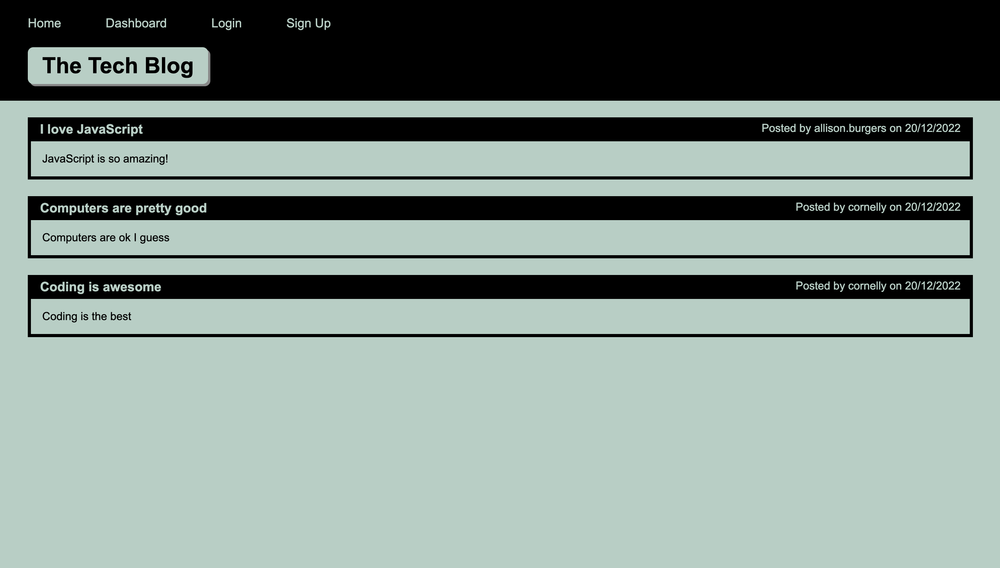
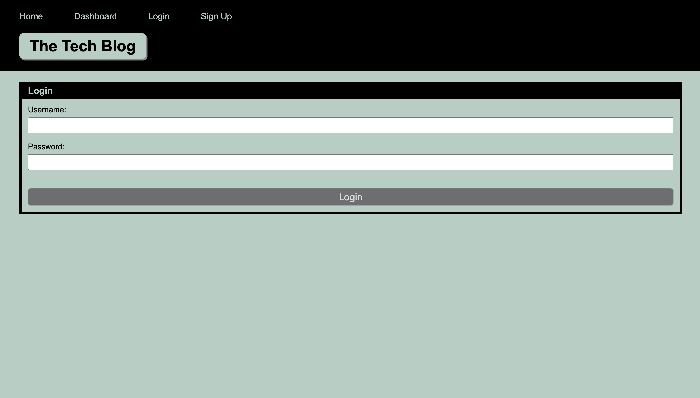
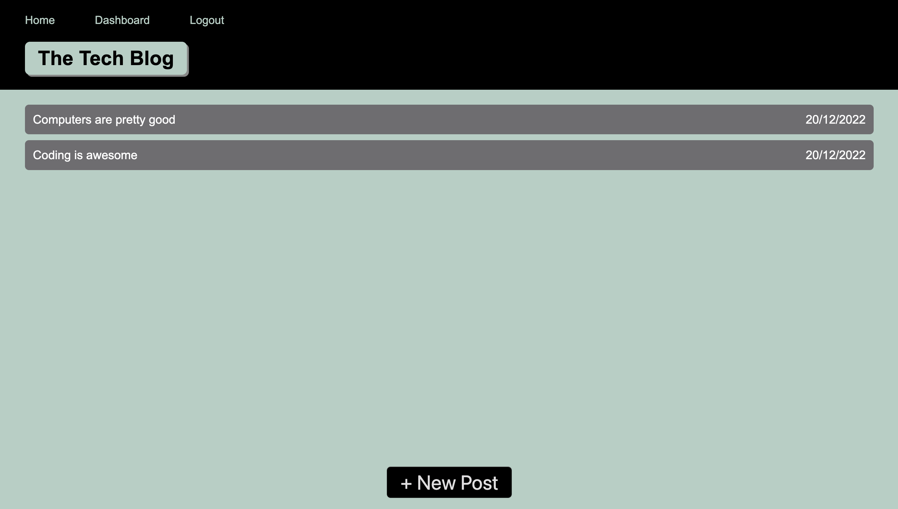
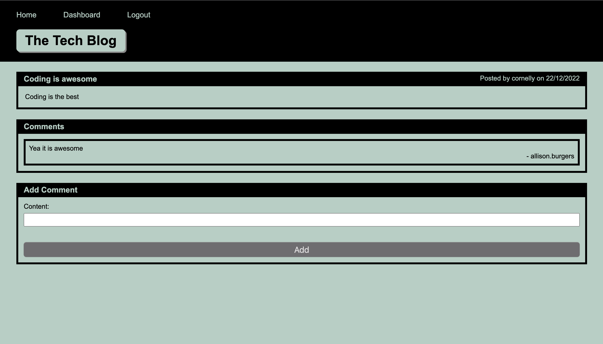

# Coding Bootcamp Week 14 Challenge - Tech Blog

## Description

This weeks challenge focused on creating a full stack tech blog. The website is fully functional as it allows the user to sign up, make posts for other people to see and post comments on other people's posts. The data is stored in a database so the user can log out and back in at another time and the data will be reloaded.

## Built With

- JavaScript
- NodeJS
  - Sequelize Package
  - Connect Session Sequelize Package
  - Express Package
  - Express Session Package
  - Express Handlebars
  - MySQL2 Package
  - Dotenv Package
  - Bcrypt Package
- SQL
- HTML and CSS

## Installation

Below are instructions on how to install and use this application:

```json
npm install
```

Create a .env file with the following content (your MySQL username and password)

```json
DB_NAME='blog_db'
DB_USER=''
DB_PASSWORD=''
```

Login to your MySQL

```json
mysql -u root -p
```

To create the database

```json
source db/schema.sql
```

Exit MySQL

```json
quit
```

To populate the database

```json
node seeds/seed.js
```

Finally you can start the application

```json
npm start
```

## Usage

To access the website, click the link below. Sign up or login to the website to be able to add new posts and comment on other people's posts.

link to webpage






## Credits

Made by [Brodie Marshall](https://github.com/brodie02)

---
